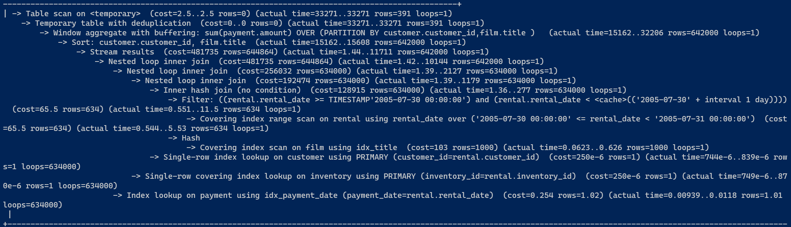
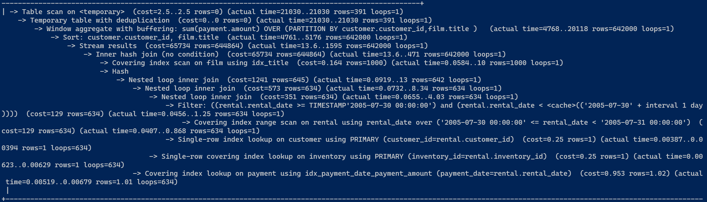
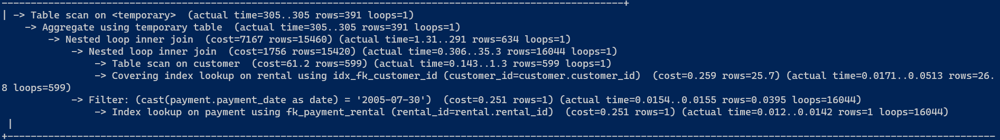

# Домашнее задание к занятию "`12-05hw`" - `Ливчак Сергей`


---

### Задание 1

`Напишите запрос к учебной базе данных, который вернёт процентное отношение общего размера всех индексов к общему размеру всех таблиц.`

1. `Из инормационной схемы берём сумму байт индексов и данных и через пропорцию находим процентное отношение размера индекса к данным`

```
SELECT ROUND((100 * SUM(index_length))/ SUM(data_length), 1) AS 'index-to-database in pct'
FROM INFORMATION_SCHEMA.TABLES
WHERE TABLE_SCHEMA = 'sakila';

```

1. **12-05hw-1** 


---

### Задание 2

`Выполните explain analyze следующего запроса:`

select distinct concat(c.last_name, ' ', c.first_name), sum(p.amount) over (partition by c.customer_id, f.title)
from payment p, rental r, customer c, inventory i, film f
where date(p.payment_date) = '2005-07-30' and p.payment_date = r.rental_date and r.customer_id = c.customer_id and i.inventory_id = r.inventory_id

`1) перечислите узкие места;`
`2) оптимизируйте запрос: внесите корректировки по использованию операторов, при необходимости добавьте индексы.`

<details>
  <summary>explain analyze запроса из задания 2</summary>

```
-> Limit: 200 row(s)  (cost=0..0 rows=0) (actual time=30450..30450 rows=200 loops=1)
    -> Table scan on <temporary>  (cost=2.5..2.5 rows=0) (actual time=30450..30450 rows=200 loops=1)
        -> Temporary table with deduplication  (cost=0..0 rows=0) (actual time=30450..30450 rows=391 loops=1)
            -> Window aggregate with buffering: sum(payment.amount) OVER (PARTITION BY customer.customer_id,film.title )   (actual time=12157..29320 rows=642000 loops=1)
                -> Sort: customer.customer_id, film.title  (actual time=12157..12614 rows=642000 loops=1)
                    -> Stream results  (cost=22e+6 rows=16.1e+6) (actual time=1.62..9130 rows=642000 loops=1)
                        -> Nested loop inner join  (cost=22e+6 rows=16.1e+6) (actual time=1.6..7620 rows=642000 loops=1)
                            -> Nested loop inner join  (cost=20.4e+6 rows=16.1e+6) (actual time=1.59..6740 rows=642000 loops=1)
                                -> Nested loop inner join  (cost=18.8e+6 rows=16.1e+6) (actual time=1.57..5857 rows=642000 loops=1)
                                    -> Inner hash join (no condition)  (cost=1.61e+6 rows=16.1e+6) (actual time=1.54..310 rows=634000 loops=1)
                                        -> Filter: (cast(payment.payment_date as date) = '2005-07-30')  (cost=1.68 rows=16086) (actual time=0.114..61.3 rows=634 loops=1)
                                            -> Table scan on payment  (cost=1.68 rows=16086) (actual time=0.0803..51 rows=16044 loops=1)
                                        -> Hash
                                            -> Covering index scan on film using idx_title  (cost=112 rows=1000) (actual time=0.0958..1.03 rows=1000 loops=1)
                                    -> Covering index lookup on rental using rental_date (rental_date=payment.payment_date)  (cost=0.969 rows=1) (actual time=0.00564..0.00814 rows=1.01 loops=634000)
                                -> Single-row index lookup on customer using PRIMARY (customer_id=rental.customer_id)  (cost=250e-6 rows=1) (actual time=671e-6..761e-6 rows=1 loops=642000)
                            -> Single-row covering index lookup on inventory using PRIMARY (inventory_id=rental.inventory_id)  (cost=250e-6 1)1)rows=1) (actual time=556e-6..651e-6 rows=1 loops=642000)

```
</details>

1. Читаем explain analyze построчно снизу вверх начиная с вложенных операций
2. Начинается всё с join по индексам таблиц inventory, customer и поиск в таблице rental по индексу rental_date, который соответствует payment_date из таблицы payment. Это всё быстрые операции.
3. Так же из-за того что мы явно не указали в join какие столцы с какими, он видимо использовал join по хеш функции. Достаточно быстрая операция`
4. Далее mysql в Nested loop inner join выполняет поиск соответствующих строк между таблицами. Этот способ затратен если база данных достаточо большая и мы видим ччто он потратил почти 7 секунд, а затем из-за большого количества данных он почти две секунды передаёт данные. с 7620 по 9130 милисекунду передаёт данные. Если мы явно зададим соответствие строк по таблицам, он не будет сравнивать кажду строку таблицы с соответсвующей строкой друго таблицы и это может стать точкой оптимизации.
5. Далее у нас идёт сортировка результатов перед применением оконной агрегации. Быстрая операция 12157..12614 мс
6. И самая тяжелая операция - оконная агрегация с буфером. Суммирование платежей по каждому customer.customer_id и film.title 12157..29320 Тут он выполняет много лишней работы. Это тоже может стать точкой оптимизации, потому как нам достаточно лишь посчитать на запрошенную нами дату, а не всё подряд`

7. В таблицах используемых для выполнения запроса для ускорения выполнения колонки по которым идёт сравнение должны быть проиндексированны.У нас в таблице не хватает проиндексированной колонки payment.payment_date. Значит для ускорения мы можем в таблице payment создать индекс "idx_payment_date". Так же мы можем уйти от преобразования каждой datatime к простой дате изменив условии where к непосредственному сравнению datatime 
```
CREATE INDEX idx_payment_date ON payment(payment_date);
...WHERE payment.payment_date >= '2005-07-30' AND payment.payment_date < DATE_ADD('2005-07-30', INTERVAL 1 DAY) and.....

```
<details>
  <summary>explain analyze после создания индекса в таблице payment по колонке payment.payment_date</summary>
  
  ```
  -> Limit: 200 row(s)  (cost=0..0 rows=0) (actual time=32360..32361 rows=200 loops=1)
    -> Table scan on <temporary>  (cost=2.5..2.5 rows=0) (actual time=32360..32361 rows=200 loops=1)
        -> Temporary table with deduplication  (cost=0..0 rows=0) (actual time=32360..32360 rows=391 loops=1)
            -> Window aggregate with buffering: sum(payment.amount) OVER (PARTITION BY customer.customer_id,film.title )   (actual time=14295..31262 rows=642000 loops=1)
                -> Sort: customer.customer_id, film.title  (actual time=14295..14728 rows=642000 loops=1)
                    -> Stream results  (cost=481735 rows=644864) (actual time=1.42..11221 rows=642000 loops=1)
                        -> Nested loop inner join  (cost=481735 rows=644864) (actual time=1.29..9700 rows=642000 loops=1)
                            -> Nested loop inner join  (cost=256032 rows=634000) (actual time=0.922..1955 rows=634000 loops=1)
                                -> Nested loop inner join  (cost=192474 rows=634000) (actual time=0.91..1180 rows=634000 loops=1)
                                    -> Inner hash join (no condition)  (cost=128915 rows=634000) (actual time=0.881..298 rows=634000 loops=1)
                                        -> Filter: ((rental.rental_date >= TIMESTAMP'2005-07-30 00:00:00') and (rental.rental_date < <cache>(('2005-07-30' + interval 1 day))))  (cost=65.5 rows=634) (actual time=0.0449..21.8 rows=634 loops=1)
                                            -> Covering index range scan on rental using rental_date over ('2005-07-30 00:00:00' <= rental_date < '2005-07-31 00:00:00')  (cost=65.5 rows=634) (actual time=0.035..10.8 rows=634 loops=1)
                                        -> Hash
                                            -> Covering index scan on film using idx_title  (cost=103 rows=1000) (actual time=0.0648..0.626 rows=1000 loops=1)
                                    -> Single-row index lookup on customer using PRIMARY (customer_id=rental.customer_id)  (cost=250e-6 rows=1) (actual time=660e-6..764e-6 rows=1 loops=634000)
                                -> Single-row covering index lookup on inventory using PRIMARY (inventory_id=rental.inventory_id)  (cost=250e-6 rows=1) (actual time=535e-6..632e-6 rows=1 loops=634000)
                            -> Index lookup on payment using idx_payment_date (payment_date=rental.rental_date)  (cost=0.254 rows=1.02) (actual time=0.0091..0.0114 rows=1.01 loops=634000)

  ```

</details>

При повторном выполнении explain analyze мы видим что он использует созданный нами индекс и на этапе фильтрации получили ускорение фильтрации с показателей 0.114..61мс до 0.0449..21.8мс, но растеряли всё приэмущество на этапе поиск соответсвий между таблицами и получили дополнительное время на обработку.  9700-7620=2080.

1. **12-05hw-2** 



8. В нашем запросе в функции оконной агрегации идёт условие   "WHERE payment.payment_date >= '2005-07-30'" и оно связывается с "sum(payment.amount)", значит для ускорения мы можем в таблице payment создать индекс "payment_date_payment_amount"  

```
CREATE INDEX idx_payment_date_payment_amount ON payment(payment_date, amount);
```
<details>
  <summary>explain analyze после создания индекса в таблице payment</summary>
  
  ```
-> Limit: 200 row(s)  (cost=0..0 rows=0) (actual time=21461..21461 rows=200 loops=1)
    -> Table scan on <temporary>  (cost=2.5..2.5 rows=0) (actual time=21461..21461 rows=200 loops=1)
        -> Temporary table with deduplication  (cost=0..0 rows=0) (actual time=21461..21461 rows=391 loops=1)
            -> Window aggregate with buffering: sum(payment.amount) OVER (PARTITION BY customer.customer_id,film.title )   (actual time=3903..20414 rows=642000 loops=1)
                -> Sort: customer.customer_id, film.title  (actual time=3903..4334 rows=642000 loops=1)
                    -> Stream results  (cost=65734 rows=644864) (actual time=14.3..1479 rows=642000 loops=1)
                        -> Inner hash join (no condition)  (cost=65734 rows=644864) (actual time=14.3..444 rows=642000 loops=1)
                            -> Covering index scan on film using idx_title  (cost=0.164 rows=1000) (actual time=0.0852..5.69 rows=1000 loops=1)
                            -> Hash
                                -> Nested loop inner join  (cost=1241 rows=645) (actual time=0.156..13.6 rows=642 loops=1)
                                    -> Nested loop inner join  (cost=573 rows=634) (actual time=0.127..8.97 rows=634 loops=1)
                                        -> Nested loop inner join  (cost=351 rows=634) (actual time=0.116..6.62 rows=634 loops=1)
                                            -> Filter: ((rental.rental_date >= TIMESTAMP'2005-07-30 00:00:00') and (rental.rental_date < <cache>(('2005-07-30' + interval 1 day))))  (cost=129 rows=634) (actual time=0.0881..3.73 rows=634 loops=1)
                                                -> Covering index range scan on rental using rental_date over ('2005-07-30 00:00:00' <= rental_date < '2005-07-31 00:00:00')  (cost=129 rows=634) (actual time=0.0783..1.05 rows=634 loops=1)
                                            -> Single-row index lookup on customer using PRIMARY (customer_id=rental.customer_id)  (cost=0.25 rows=1) (actual time=0.00398..0.00405 rows=1 loops=634)
                                        -> Single-row covering index lookup on inventory using PRIMARY (inventory_id=rental.inventory_id)  (cost=0.25 rows=1) (actual time=0.00308..0.00316 rows=1 loops=634)
                                    -> Covering index lookup on payment using idx_payment_date_payment_amount (payment_date=rental.rental_date)  (cost=0.953 rows=1.02) (actual time=0.0049..0.00665 rows=1.01 loops=634)

  ```

</details>

При повторном выполнении explain analyze мы так же видим что получили не только ускорение оконной агрегации на 4 секунды, но и Nested loop inner join, по скольку там идёт поиск соответсвий между таблицами 

2. **12-05hw-2** 


9. Можно изменить запрос и сделать запросы join явными, задать условие по дате 2005-07-30 и отсортировать вывод. Тогда на выполнение запроса нужны будут доли секунды

```
SELECT CONCAT(customer.last_name, ' ', customer.first_name), SUM(payment.amount)
FROM payment
INNER JOIN rental ON payment.rental_id = rental.rental_id
INNER JOIN customer ON rental.customer_id = customer.customer_id
WHERE DATE(payment.payment_date) = '2005-07-30'
GROUP BY customer.customer_id, customer.last_name, customer.first_name;
```

<details>
  <summary>explain analyze после изменения запроса с явным заданием join</summary>

-> Limit: 200 row(s)  (actual time=289..289 rows=200 loops=1)
    -> Table scan on <temporary>  (actual time=289..289 rows=200 loops=1)
        -> Aggregate using temporary table  (actual time=289..289 rows=391 loops=1)
            -> Nested loop inner join  (cost=7167 rows=15460) (actual time=0.7..281 rows=634 loops=1)
                -> Nested loop inner join  (cost=1756 rows=15420) (actual time=0.134..24.2 rows=16044 loops=1)
                    -> Table scan on customer  (cost=61.2 rows=599) (actual time=0.0898..1.28 rows=599 loops=1)
                    -> Covering index lookup on rental using idx_fk_customer_id (customer_id=customer.customer_id)  (cost=0.259 rows=25.7) (actual time=0.0177..0.0337 rows=26.8 loops=599)
                -> Filter: (cast(payment.payment_date as date) = '2005-07-30')  (cost=0.251 rows=1) (actual time=0.0153..0.0154 rows=0.0395 loops=16044)
                    -> Index lookup on payment using fk_payment_rental (rental_id=rental.rental_id)  (cost=0.251 rows=1) (actual time=0.012..0.0146 rows=1 loops=16044)


</details>

3. **12-05hw-2** 


---
